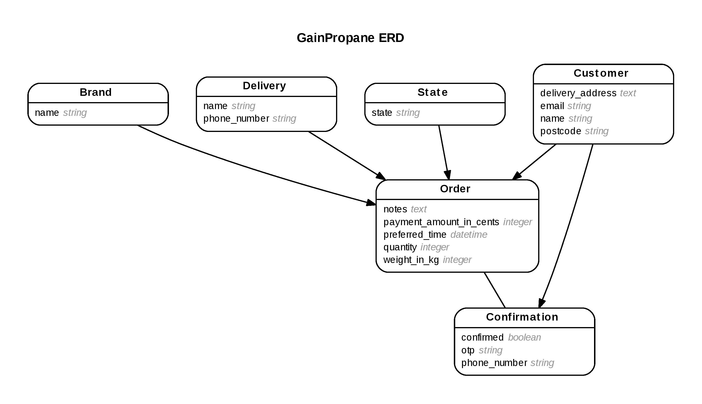

## GrabGas Lite Rails Assessment

This is NEXTACADEMY Rails assessment. You are not allowed to copy or share the files from this repo without
written permission from NEXTACADEMY.

This is a mock exercise to create a lite version of the GrabGas.

An example of a working app can be found here: http://gain-propane.herokuapp.com/

## Duration
8 Hours

## To Start
1. Fork the repo.
2. Clone the repo down to your local machine.
3. Add your Ruby version into Gemfile.
4. Work on your solution (on branch).
5. Push and commit as frequent as possible (at least every 1 hour).
6. Raise a Pull Request.


## Models:



## Routes:


```
          Prefix Verb  URI Pattern                     Controller#Action
          ------ ----  --- -------                     -----------------
   order_summary GET   /orders/:order_id/summary       orders#summary
          orders POST  /orders                         orders#create
           order PATCH /orders/:id                     orders#update
                 PUT   /orders/:id                     orders#update
       customers POST  /customers                      customers#create
    new_customer GET   /customers/new                  customers#new
   confirmations POST  /confirmations                  confirmations#create
new_confirmation GET   /confirmations/new              confirmations#new
    confirmation PATCH /confirmations/:id              confirmations#update
                 PUT   /confirmations/:id              confirmations#update
 delivery_orders GET   /deliveries/:delivery_id/orders deliveries#orders
      deliveries GET   /deliveries                     redirect(301, deliveries/login)
login_deliveries GET   /deliveries/login               deliveries#login
                 POST  /deliveries                     deliveries#create
            root GET   /                               home#index
```
